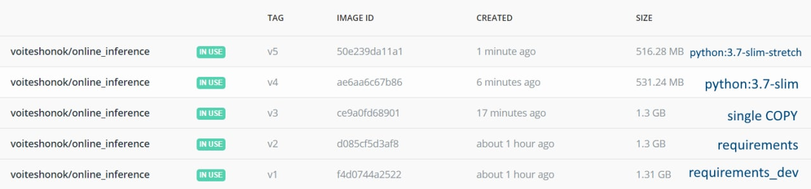

# ML in Production HW2

### Running container
```
docker pull voiteshonok/online_inference:v5
docker run -p 8000:8000 -it voiteshonok/online_inference:v5
```

### Running make_request.py
After you have a running container, you can also run make_request.py script to test the API on the original dataset.  
For this you need to place [Heart Disease UCI data](https://www.kaggle.com/ronitf/heart-disease-uci) under data folder, 
so that it's path is data/archive.zip.

### Testing
You can use pytest to run unit-tests for the API. In order for this to work, place the model file next to app.py 
(the default name for the model file is model.pickle, though you can change the path by setting PATH_TO_MODEL environment variable). 
Also you'll have to install virtual environment with Python 3.7 and 
requirements from requirements_dev.txt.

### Docker image optimizations
Here are the optimizations I've tried (blue text on the right of the screenshot describes changes to [the sample Dockerfile](https://github.com/made-ml-in-prod-2021/inference_examples/blob/main/online_inference/Dockerfile)).
requirements_dev.txt is a file produced with pip freeze, requirements.txt contains only the packages needed for inference.  
Compressed v5 image on docker hub is 216.54 MB.
